# Relatório Final - Dominó
### ***Projeto desenvolvido durante o Segundo Semestre no curso de Ciência da Computação na PUC-SP***. 
**Disciplina**: Laboratório de Programação (LP). 
**Integrantes do grupo:**: 
Cinthia Alves Barreto; 
Igor Matos Gaeta; 
Guilherme Diniz Leocadio; 
Lucas Cassolino D' Azevedo; 
**Linguagem**: C  
**IDE utilizada**: Code Blocks. 
**Tempo de desenvolvimento do projeto**: 8 semanas. 

#### **Etapas do Programa**:
* **Etapa 01** – Tipo agregado (homogêneo e heterogêneo) e I/O (vídeo e teclado) em C;
* **Etapa 02** – Padrão MVC (Model-View-Controller);
* **Etapa 03** – Funções e Procedimentos (Lógica do Jogo e Interação com o Usuário);
* **Etapa 04** – Funções e Procedimentos (Lógica do Jogo e Interação com o Usuário);
* **Etapa 05** – Arquivos em C;
* **Etapa 06** – Computador Jogador > Jogador versus Computador inteligente. 

------

### Descrição do jogo do ponto de vista do que realmente aparece nas telas.

<ul>
    <li>Menu principal, na primeira tela ao abrir o dominó mostra as opções de Iniciar o jogo, na qual as peças serão geradas e distribuídas, já realizando a primeira jogada da maior peça e indicando qual jogador foi o primeiro a jogar.</li>
    <li>Ao selecionar a opção de Iniciar Jogo, o jogador poderá escolher entre jogar sozinho contra o computador ou jogar contra outro jogador em um multiplayer local.</li>
    <li>Escolhendo a quantidade de jogadores, a partida começa, os jogadores recebem suas peças e tem acesso ao menu do jogador, onde nele é possível visualizar a mesa, suas peças disponíveis, jogar peças, comprar peças, passar sua vez, salvar o jogo e abandonar a partida.</li>
    <li>Ao selecionar a opção de Jogar Peça, o jogador pode selecionar qual peça da sua mão ele quer jogar, ao selecionar a peça ele pode escolher se quer jogar a peça no lado esquerdo ou direito da mesa.</li>
    <li>O jogador  pode comprar uma peça do bolo caso não tenha uma peça para realizar a ação de jogar ou por ter optado esta opção.</li>
    <li>O jogador pode selecionar a opção Passar vez para não jogar nenhuma peça e passar o turno para o adversário.</li>
    <li>Opção Salvar permite que os jogadores possam fechar o jogo e reabri-lo posteriormente para continuar a jogar.</li>
    <li>O jogador pode selecionar a opção de Abandonar a partida, para encerrar o jogo e voltar para o menu principal, onde pode sair ou iniciar outra partida.</li>
    <li>Novamente no menu inicial, o jogador pode selecionar a opção de Recuperar Jogo, para restaurar uma partida que foi previamente salva e continuar jogando de onde parou.</li>
    <li>Por fim, a opção Sair apenas encerra o programa.</li>
</ul>

-----
### Apresentação das telas (suas opções, comentários, etc).
1 -  Menu inicial 
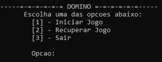 
2 - Seleção de jogadores 
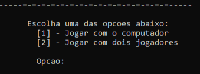 
3 - Início do jogo contra o computador 
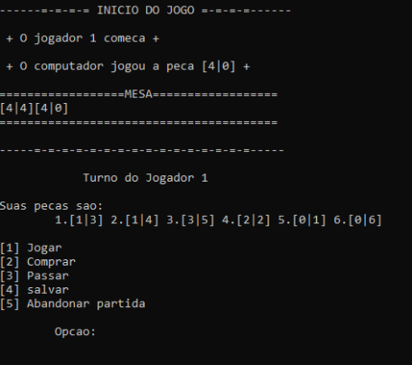 
4 -  Início do jogo contra outro jogador 
 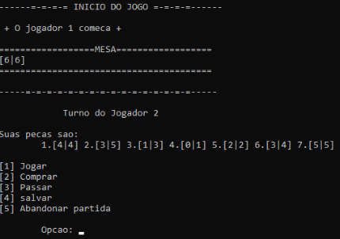 
5 -  Após escolher a opção jogar, o jogador seleciona o lado da mesa para jogar a peça 
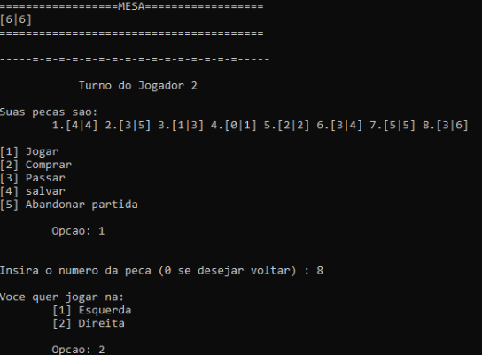 
6 - Opção para o jogador comprar a peça 
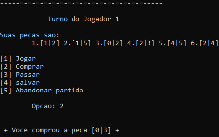 
7 - Opção do menu para o jogador passar sua vez 
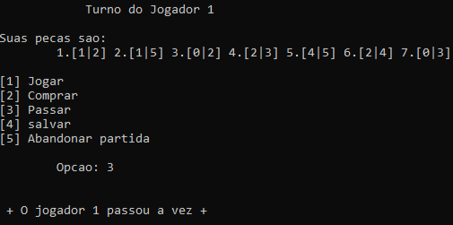 
8 - Opção para o jogador salvar o jogo 
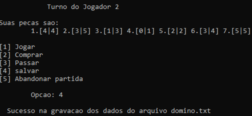 
9 -  Possibilita ao jogador abandonar a partida 
 
10 - Opção para o jogador recuperar o jogo salvo previamente 
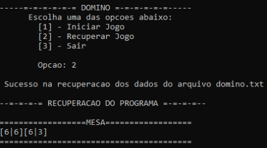 
11 -  Possibilita ao jogador abandonar a partida 
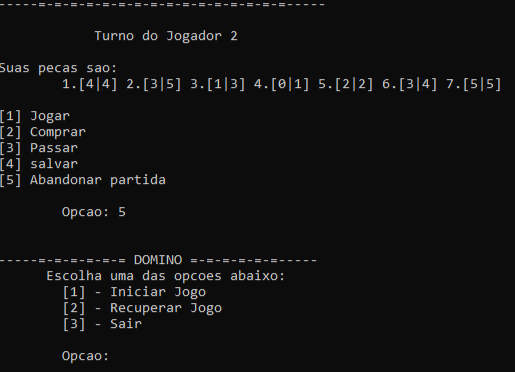 

3. Estruturas de dados usadas (devem estar no “model”) 
***model.h***

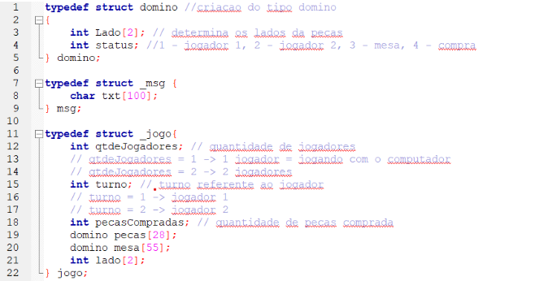

-----

### Organização do código em termos de módulos, funções e procedimentos.
#### Assinaturas View
* void ViewMenu() = imprime o menu principal;
* void ViewJogador() = imprime o menu do jogador;
* void imprimirMsg(int); = Imprime mensagens alocadas em um vetor ;
* void mostrarMsgJogador(int); = Imprime mensagens para os jogadores;
* void mostrarMsgPeca(int, int)  = Imprime mensagens sobre a ações com peças (“O computador jogou a peça [3][1]”);
* void viewJogador(); = Imprime o menu para os jogadores; 
* void viewMenuFimDaPartida() = mostra o menu da partida;
* void imprimirMesa() = Imprime a mesa.

#### Assinaturas Model
* void gerarPecas() =  Gera as 28 peças do jogo;
* void embaralharPecas() =  Embaralha as peças; 
* void mudaLado(int); = Permite ao jogador girar a peça na hora de jogar;
* void distribuirPecas() =  Distribui as peças aos jogadores;
* void salvarJogo()  = salva todas as variáveis da struct jogo;
* void recuperarJogo() = recupera todas as variáveis da struct jogo.

#### Assinaturas Controller
* void menuDomino() = Menu inicial do jogo, que permite começar o jogo, carregar um jogo inacabado ou sair do programa;
* int maiorPeca() = joga a maior peça dos jogadores e indica qual jogador que começou;
* void iniciarJogo() = inicia jogo;
* void menuJogador() = menu com o switch case das opções que o jogador tem durante o turno;
* void compraPeca() = permite que o jogador compre peças;
* int jogarPeca() =  joga a peça que o jogador escolheu na mesa;
* int verificaJogada(int, int) =  verifica se a jogada é válida ou não;
* int verificaFim(); = verifica se ainda há peças na mão dos jogadores;
* int jogoTrancado(); = verifica se o jogo está trancado;
* int somaPJogador(); = soma a quantidade de pontos nas peças dos dois jogadores, caso o jogo esteja trancado;
* int verificaRobo()  = verifica se o computador pode jogar, caso possa, ele jogará, caso não possa, o computador tentará comprar, caso nenhuma dessas condições sejam satisfeitas, o computador passará.
* void trocarTurno() = troca o valor do turno para que o outro jogador jogue.
